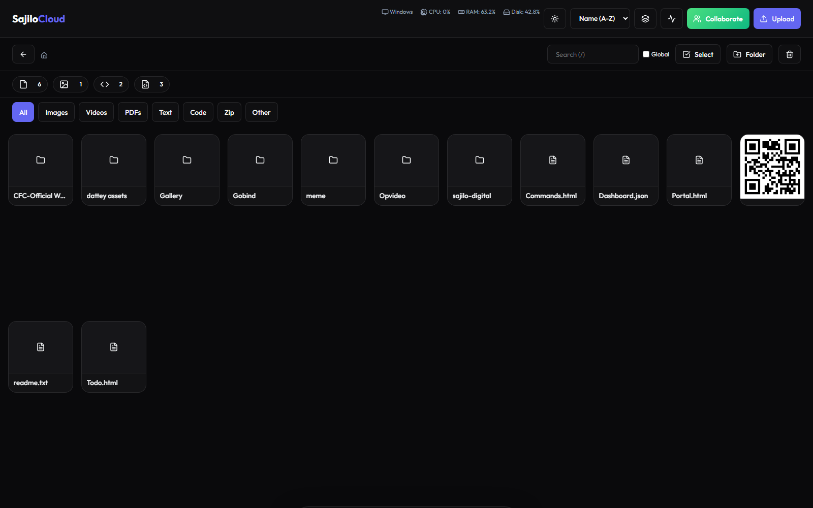
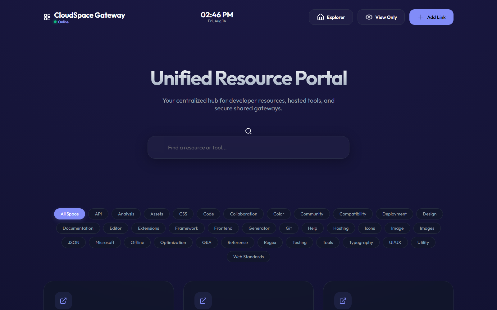

<div align="center">

# SajiloCloud

### A modern, self-hosted file manager & server for your local network

**by [Arun Neupane](https://github.com/arundada9000) - CTO & Lead Architect, [Sajilo Digital Pvt. Ltd.](https://sajilodigital.com.np)**


</div>

---

SajiloCloud is a **self-hosted, LAN-based file manager and web server** built with pure Python and vanilla web technologies. It runs on your own machine and is accessed from any device on the **same Wi-Fi network** - no internet, no cloud, no third-party hosting.

It gives you a beautiful, responsive interface to **upload, download, rename, move, delete, zip, search, and edit files** directly from your browser, plus a **real-time collaborative whiteboard & scratchpad** for anyone on your network.

> **Important:** This software is **not free to use**. It is proprietary - every use requires explicit written permission from the copyright holder. See [LICENSE](LICENSE).

---

## Screenshots

**File Manager** - browse, upload, edit, and manage files from any device on your network:



**Portal Dashboard** - the personal dashboard page:



---

## Table of Contents

- [Screenshots](#screenshots)

- [Features](#features)
- [Tech Stack](#tech-stack)
- [Quick Start](#quick-start)
- [Documentation](#documentation)
- [How It Works (Same-Network Serving)](#how-it-works-same-network-serving)
- [Domains / Aliases](#domains--aliases)
- [Project Structure](#project-structure)
- [Batch Files](#batch-files)
- [API Overview](#api-overview)
- [Security](#security)
- [Author](#author)
- [License](#license)

---

## Features

- **Modern UI/UX** - Sleek glassmorphism design with Dark/Light mode.
- **File Management** - Upload, download, rename, move, and delete files/folders.
- **Batch Operations** - Select multiple items to zip, move, or delete in bulk.
- **Code Editor** - Integrated Monaco Editor (VS Code engine) to edit code on the fly.
- **Media Viewer** - Fullscreen image/video viewer with navigation & download controls.
- **Recycle Bin** - Soft delete with restore and permanent purge.
- **System Monitoring** - Real-time CPU, RAM, and disk usage.
- **Local Connectivity** - Auto-generated QR code for instant mobile access.
- **Search** - Fast local and global file search.
- **Collaborative Tools** - Real-time shared canvas & scratchpads over WebSockets.
- **mDNS Domains** - Friendly hostnames like `http://arun.local` (no IP memorization).

## Tech Stack

### Backend
| Component | Technology |
|-----------|------------|
| Language | Python 3.7+ |
| HTTP Server | Native `http.server` (zero heavy frameworks) |
| Real-time | `websockets` (WebSocket server on port `4143`) |
| mDNS | `zeroconf` - registers friendly `.local` domains |
| System stats | `psutil` |
| QR codes | `qrcode[pil]` |
| Persistence | JSON files under `data/` |

### Frontend
- **Structure:** HTML5 - **Styling:** CSS3 (Variables, Flexbox, Grid, Glassmorphism) - **Logic:** Vanilla JavaScript (ES6+)
- **Libraries (CDN):** Lucide Icons, Monaco Editor, Marked.js, Highlight.js

## Quick Start

```bash
# 1. Clone the repository
git clone https://github.com/arundada9000/sajilocloud.git
cd sajilocloud

# 2. Install dependencies
pip install -r requirements.txt

# 3. Start the full stack (HTTP + WebSocket)
python server.py # HTTP server -> http://localhost:4142
python websocket_server.py # WebSocket -> ws://localhost:4143
```

Open `http://localhost:4142` on the same machine, or scan the QR code that appears in the terminal with any phone **on the same Wi-Fi**.

> **New here?** Read the [Dummy-Proof Quickstart](docs/QUICKSTART.md) - it assumes you have never used a terminal before.

## Documentation

| Guide | Description |
|-------|-------------|
| [Dummy-Proof Quickstart](docs/QUICKSTART.md) | Zero-experience setup & run guide |
| [Installation Guide](docs/INSTALLATION.md) | Detailed install on Windows / macOS / Linux |
| [Running the Server](docs/RUNNING.md) | All launch methods, incl. the `.bat` files |
| [How It Works](docs/HOW-IT-WORKS.md) | Architecture & request flow |
| [Networking & Domains](docs/NETWORK.md) | Same-Wi-Fi serving, mDNS, ports, QR |
| [Configuration](docs/CONFIGURATION.md) | Every `config.json` option |
| [API Reference](docs/API.md) | All REST & WebSocket endpoints |
| [Collaborative Tools](docs/COLLABORATIVE.md) | Canvas & scratchpad usage |
| [Deployment](docs/DEPLOYMENT.md) | Firewall, services, port forwarding |
| [Control Panel & Batch Files](docs/CONTROL-PANEL.md) | GUI + `.bat` launchers |
| [Troubleshooting](docs/TROUBLESHOOTING.md) | Common problems & fixes |
| [FAQ](docs/FAQ.md) | Frequently asked questions |
| [Developer Guide](docs/DEVELOPMENT.md) | Contribute to the codebase |

## How It Works (Same-Network Serving)

SajiloCloud is designed to be **local-first**. It binds to `0.0.0.0` on your machine, so **any device connected to the same Wi-Fi / LAN** can reach it. It does **not** work over the internet out of the box.

1. **HTTP server** (`server.py`) serves the web app and files on port `4142` (default).
2. **WebSocket server** (`websocket_server.py`) powers real-time collaboration on port `4143`.
3. **mDNS service** (`dns_service.py`) registers friendly `.local` hostnames so you can type a name instead of an IP.
4. **QR code** (`Home/qr.png`) is generated at startup so phones join with one scan.

```
+---------------------+   HTTP :4142   +----------------------+
|  Your PC            |<--------------+|  SajiloCloud server  |
|  (server)           |   WS :4143    |  python server.py    |
+---------------------+               +----------------------+
      ^
      |  same Wi-Fi network
      |
+---------------------+
|  Phone              |   scan QR -> http://arun.local
|  Laptop             |
|  Tablet             |
+---------------------+
```

> The server is not exposed to the public internet by default. Only devices on your Wi-Fi network can reach it. See [docs/NETWORK.md](docs/NETWORK.md) for details, and [docs/DEPLOYMENT.md](docs/DEPLOYMENT.md) if you ever want remote access (requires port forwarding / VPN - at your own risk).

## Domains / Aliases

The author's configuration registers these mDNS aliases. Each becomes a reachable hostname on the same network:

| Domain | Domain | Domain | Domain |
|--------|--------|--------|--------|
| `http://sajilo.local` | `http://server.local` | `http://pooja.local` | `http://pooju.local` |
| `http://18.local` | `http://dattey.local` | `http://gayjay.local` | `http://arun.local` |
| `http://karuna.local` | `http://miss.local` | `http://gaynil.local` | `http://gunil.local` |
| `http://gay.local` | `http://goban.local` | `http://chikni.local` | `http://virat.local` |
| `http://kohli.local` | `http://arundada9000.local` | `http://a.local` | `http://b.local` |

> You can add or remove aliases freely in `config.json` -> `aliases`. They only resolve while the server is running and the device is on the same network.

## Project Structure

```
sajilocloud/
|-- server.py # Main HTTP file server
|-- websocket_server.py # Real-time collaboration WebSocket server
|-- api_handlers.py # All REST API endpoint handlers
|-- collaborative_manager.py # Canvas/scratchpad persistence layer
|-- dns_service.py # mDNS .local domain registration
|-- audit_logger.py # Activity logging (data/activity_log.json)
|-- temp_handler.py # Portal data helper
|-- server_control_panel.py # Desktop GUI control panel
|-- repro_mdns.py # mDNS debugging/repro script
|-- app.js / index.html / styles.css # Frontend (vanilla JS)
|-- modules/collaborative/ # Canvas + scratchpad frontend modules
|-- images/icons/ # Site icons & favicons
|-- Home/ # Uploaded files live here (git-ignored)
| |-- Portal.html # Dashboard "Portal" page
| |-- Commands.html # Command reference page
| |-- Todo.html # To-do app page
| |-- Dashboard.json # Dashboard data
| |-- commands/ # Command reference data (JSON)
| \-- useful-info/ # Hidden app data (PortalData.json)
|-- data/ # Runtime logs (git-ignored, auto-created)
|-- config.json # Server config (git-ignored, contains secret)
|-- config.json.example # Safe config template
|-- requirements.txt # Python dependencies
\-- docs/ # Documentation
```

## Batch Files

On Windows, three launchers are provided:

| File | What it does |
|------|--------------|
| `Start App.bat` | Opens the desktop **Control Panel GUI** (`server_control_panel.py`) |
| `start_server.bat` | Runs the **HTTP server only** (`python server.py`) |
| `start_servers.bat` | Runs **both** the WebSocket server and HTTP server |

Full walkthroughs in [docs/CONTROL-PANEL.md](docs/CONTROL-PANEL.md) and [docs/RUNNING.md](docs/RUNNING.md).

## API Overview

REST (served by `server.py`):

| Method | Endpoint | Purpose |
|--------|----------|---------|
| GET | `/api/list?path=...` | List directory contents |
| GET | `/api/search?q=...` | Search files/folders |
| GET | `/api/sysinfo` | CPU / RAM / disk usage |
| GET | `/api/all_folders` | All folders (for move dialogs) |
| GET | `/api/recycle_bin` | List recycle bin |
| GET | `/api/activity` | Recent activity logs |
| GET | `/api/comments?path=...` | File comments |
| GET | `/api/portal_data` | Portal page data |
| GET | `/api/collaborative/sessions` | List collab sessions |
| POST | `/api/upload?path=...` | Upload file(s) |
| POST | `/api/mkdir` | Create folder |
| POST | `/api/delete` | Move item to recycle bin |
| POST | `/api/restore` / `/api/purge` | Restore / permanently delete |
| POST | `/api/rename` | Rename / move |
| POST | `/api/save_json` | Save a JSON file |
| POST | `/api/batch_delete` | Batch soft-delete |
| POST | `/api/zip` | Zip selected items |
| POST | `/api/comments` | Add a comment |
| POST | `/api/collaborative/save` | Save a session |

WebSocket (`ws://<host>:4143`) - real-time rooms for shared canvases & scratchpads. See [docs/API.md](docs/API.md).

## Security

- `config.json` (contains the **admin key**) is **git-ignored** - never commit it.
- The admin key unlocks hidden folders via `?show_hidden=<key>`.
- Activity is logged to `data/activity_log.json` (git-ignored, capped at 100 entries).
- Soft deletes go to a recycle bin; nothing is instantly destroyed.
- This is a **LAN tool** - treat it as trusted-network software. See [SECURITY.md](SECURITY.md) for the full policy and [docs/DEPLOYMENT.md](docs/DEPLOYMENT.md) for hardening notes.

## Author

**Arun Neupane** - `@arundada9000`

- **Role:** CTO & Lead Architect, [Sajilo Digital Pvt. Ltd.](https://sajilodigital.com.np) - Frontend Developer
- **Location:** Butwal, Lumbini, Nepal
- **Website:** [arunneupane.vercel.app](https://arunneupane.vercel.app)
- **Email:** [arunneupane0000@gmail.com](mailto:arunneupane0000@gmail.com)
- **GitHub:** [github.com/arundada9000](https://github.com/arundada9000)
- **LinkedIn:** [linkedin.com/in/arundada9000](https://www.linkedin.com/in/arundada9000)
- **X / Twitter:** [@arundada9000](https://x.com/arundada9000)

*"I like to code till I don't like to code. (It never happens.)"*

## License

**Proprietary - All Rights Reserved.**

SajiloCloud is **not free for use**. Explicit written permission from the copyright holder is required for every use, including copying, running, modifying, distributing, or building upon it. See the full terms in [LICENSE](LICENSE). For permission requests, contact [arunneupane0000@gmail.com](mailto:arunneupane0000@gmail.com).

---

<div align="center">

*A cloud so local, it never rains on your files.*

*Take the cloud, put it on your desk, and call it yours.*

</div>

---

<div align="center">
<sub>Built in Nepal - © 2026 Arun Neupane / Sajilo Digital Pvt. Ltd.</sub>
</div>
